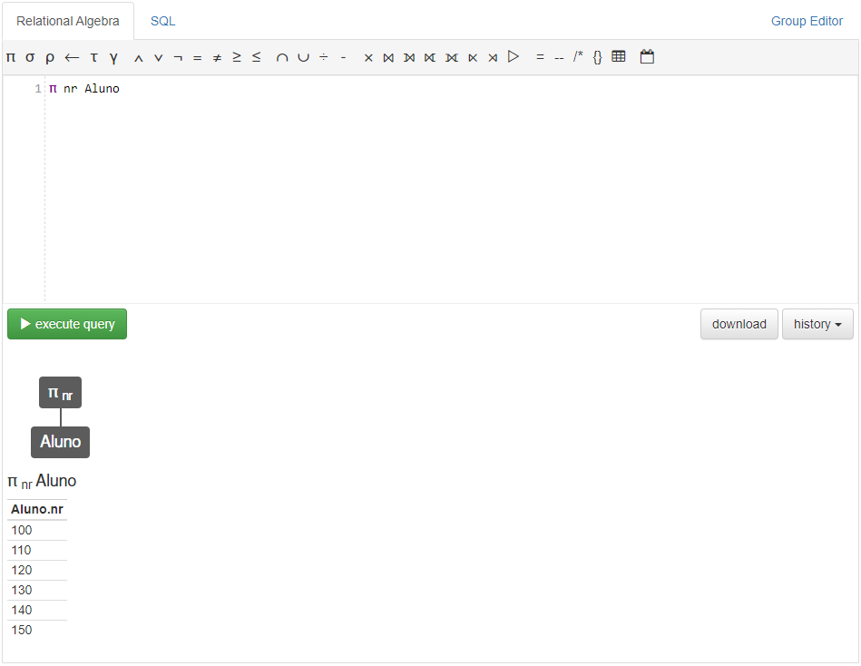
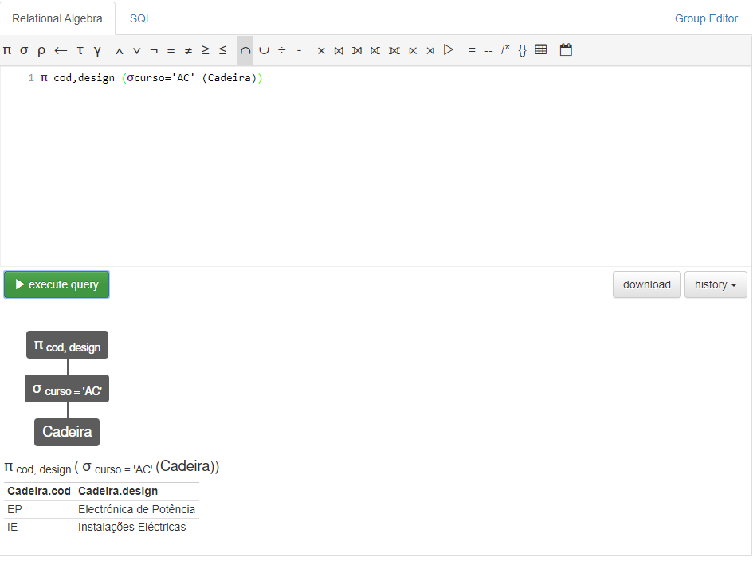
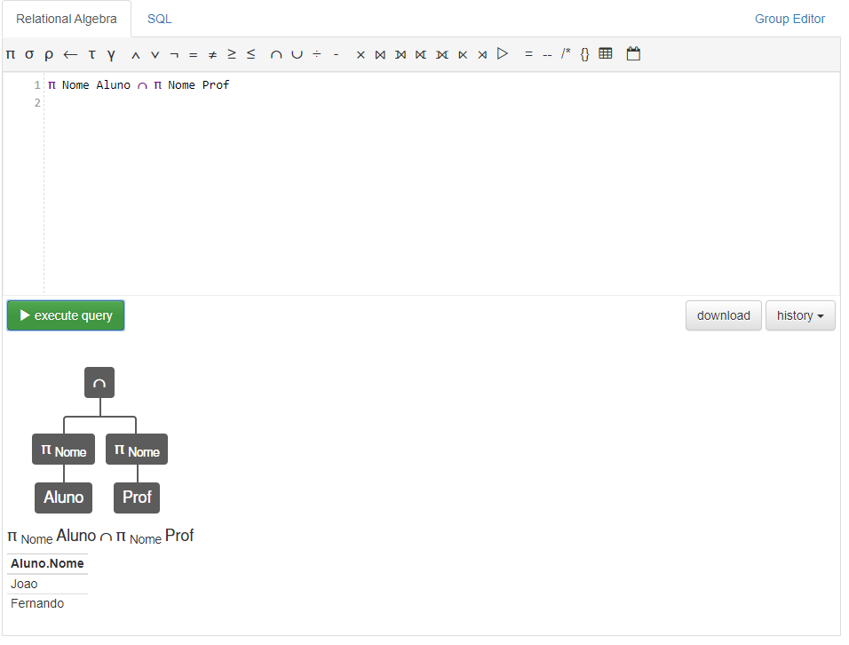
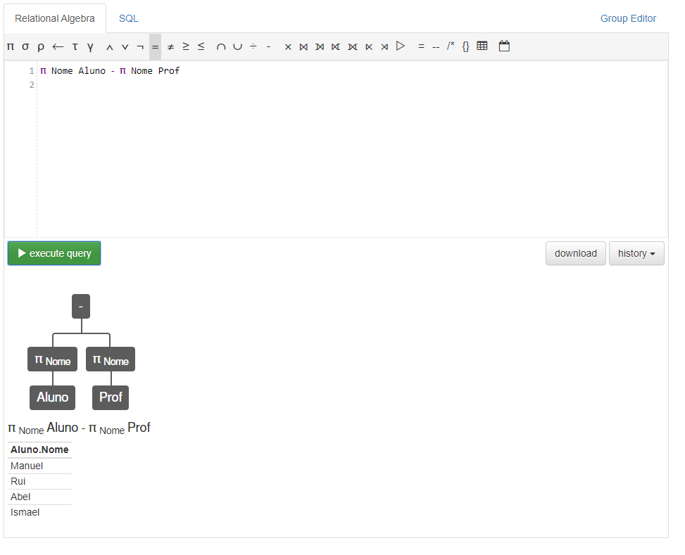
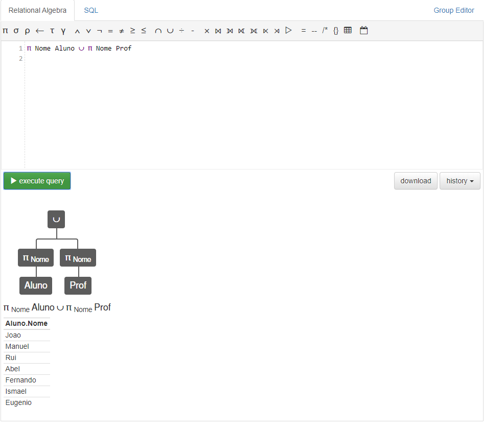
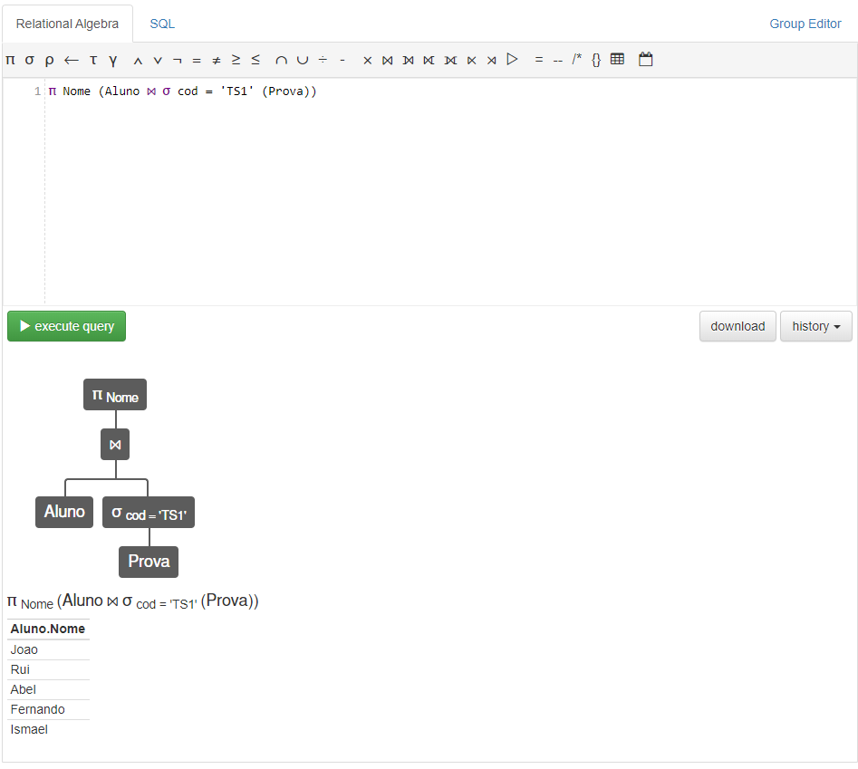
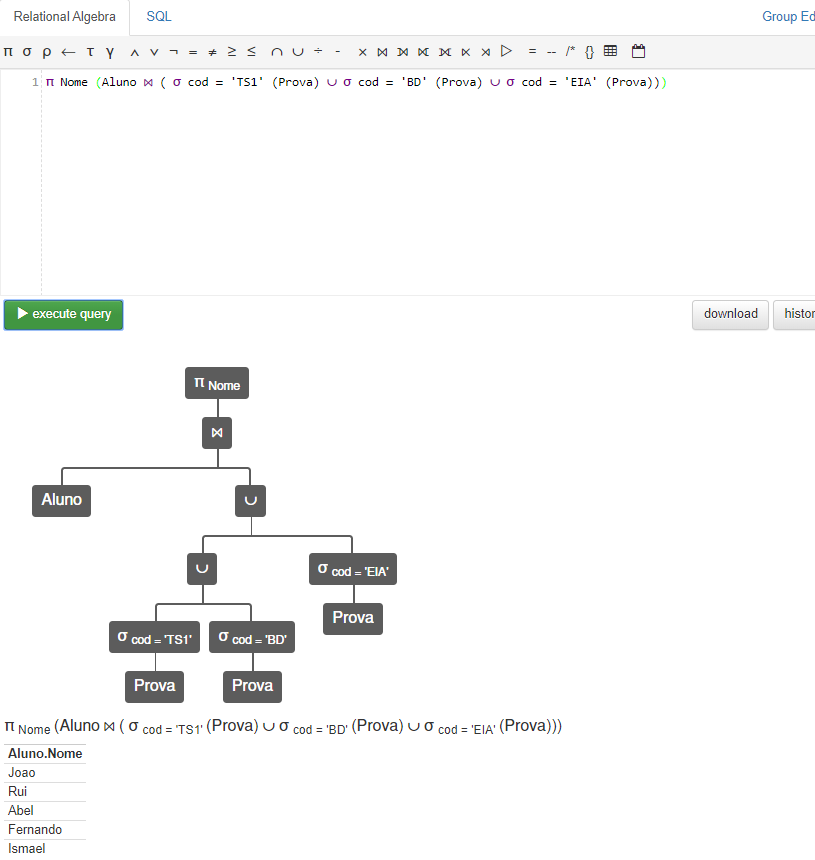

## Aula sobre Algebra Relacional

1. Abrir o Relax
2. Modificar a Base de Dados para a fornecida no Moodle
3. Resolver os 17 exercícios que estão na ficha

### 1. Quais	os	números	dos	alunos?
  
### 2. Qual	o	código	e	designação	das	cadeiras	do	curso	'AC'?

### 3. Existem	nomes	comuns	a	alunos	e	profs?	Quais?

### 4. Quais	os	nomes	específicos	dos	alunos,	i.e.,	que	nenhum	professor	tem?

### 5. Quais	os	nomes	das	pessoas	relacionadas	com	a	faculdade?

### 6. Quais	os	nomes	dos	alunos	que	fizeram	alguma	prova	de	'ts1'?

### 7. Quais	os	nomes	dos	alunos	com	inscrição	no	curso	'IS'?

### 8. Qual	a	relação	dos	nomes	dos	alunos que	concluíram	o	curso	'IS'.
```sh

```
### 9. Qual	a	nota	máxima	existente	nas	provas?
```sh
γ max(nota)->avg Prova
```
### 10. Qual	a	nota	média	nas	provas	de	BD?
```sh
γ avg(nota)->avg (σ cod = 'BD' (Prova))
```
### 11. Qual	o	número	de	alunos?
```sh
γ count(nr)->numero Aluno
```
### 12. Qual	o	número	de	cadeiras	de	cada	curso?
```sh
γ curso; count(cod)->count Cadeira
```
### 13. Qual	o	número	de	provas	de	cada	aluno?
```sh
γ nr; count(nota)->count Prova
```
### 14. Qual	a	média	do	número	de	provas	por	aluno?
```sh
aluno = γ nr; count(nota)->count Prova
γ avg(count)->media aluno
```
### 15. Qual	o	nome	e	respetiva	média	atual	(cadeiras	feitas,	em	qualquer	curso) de cada	aluno?
```sh
tabela = γ nr; avg(nota)->notas Prova
π Nome, notas (tabela ⨝ Aluno)
```
### 16. Qual	a	nota	máxima	de	cada	cadeira	e	qual	o	aluno	que	a	obteve?
```sh
tabela = γ nr; max(nota)->notas Prova
π Nome, notas (tabela ⨝ Aluno)
```
### 17. Obtenha	a	relação	ordenada	por	curso	dos	nomes	dos	alunos	formados.
```sh

```
