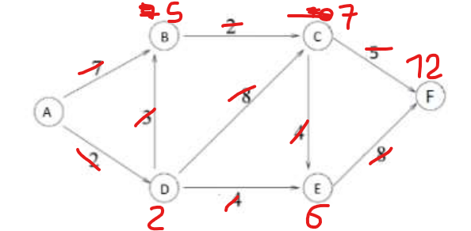
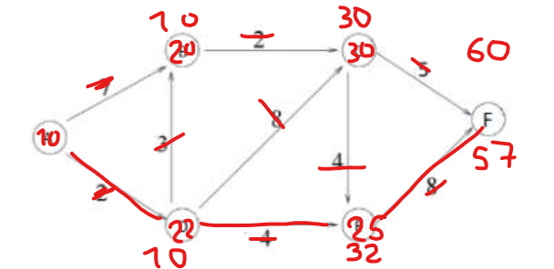
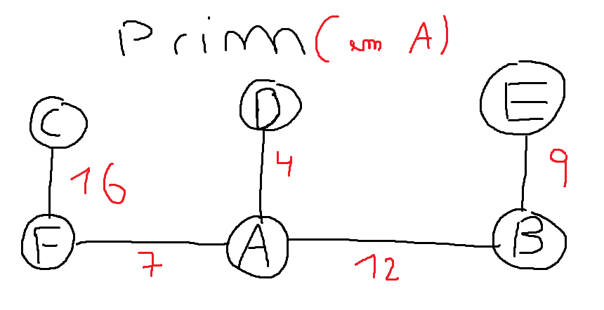
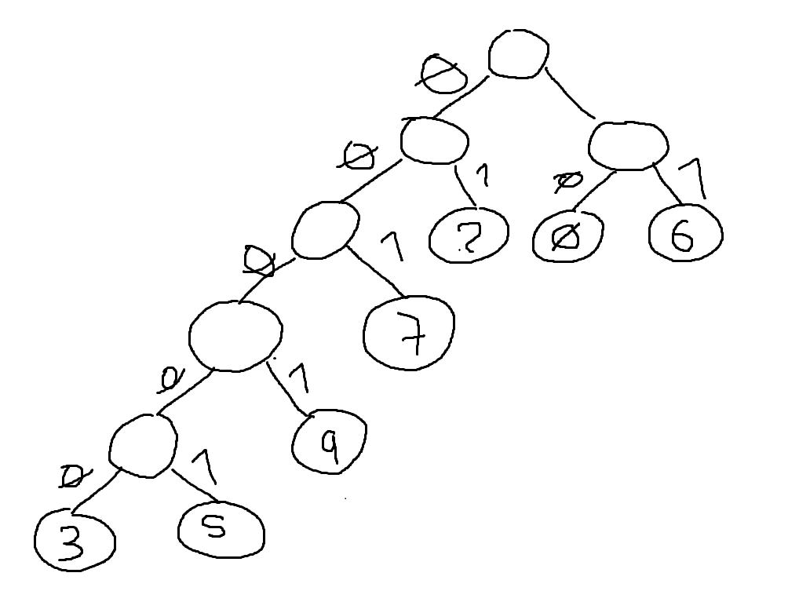

# Pergunta 2

## a)

Logo, o caminho mais curto é :
**A->D->B->C->F**

## b)

Neste caso, é necessário ver o peso do próprio vértice em vez das próprias arestas

Logo, o caminho mais curto é:
**A->D->E->F**

## c)

A afirmação é falsa:

Este método não chega para gerar uma organização topológica, pelo que não há garantia de que a ordem topológica seja cumprida.

Um vértice pode estar bastante perto de O, mas haver outro caminho que chegue a O que parta desse vértice e viole a ordenação topológica.

Se aplicarmos este método ao grafo apresentado na figura de pergunta 2, não iriamos obter uma ordenação topológica válida

A -> B = 7
A -> D = 7
A -> C = 7
A -> E = 11

Ordenando, ficaria:

A,E,B,C,D,F, o que não seria possível

# Pergunta 3

## a)
É necessário Usar o algoritmo de Prim para obter a árvore de expansão mínima.

## b)

A afirmação é verdadeira, dado que a única outra ligação é CD, e tem um custo maior do que qualquer outra ligação no grafo, logo, nunca será feita antes de CF.

## c)

A afirmação é falsa, sendo fácil de encontrar um contra exemplo, dado que, no próprio algoritmo de Prim, dependendo do vértice que se começa, vão haver ligações diferentes.

O método não garante o caminho mínimo, sendo um algoritmo ganancioso que apenas verifica o melhor caminho em cada passo

## Pergunta 4

## a)

T1 : Bottleneck de 3
T2 : Bottlenect de 6
T3 : Bottleneck de 4

## b)

!! Ver depois !!

## c)

Iria causar um bottleneck de T2 = 4

##Pergunta 5
Há 10 carateres.  
O vetor associa cada carater à sua frequência
## a)

log2(7) = 3
Logo, é necessário 3 bits para representar um número.  

Somando as frequências, há 40 ocorrências.  
Logo, são necessários  40*3 = 120 bits

## b)
Para usar o algoritmo de Huffman, é ordenar os carateres por frequência:

0 -> 10
6 -> 10
2 -> 5
7 -> 5
9 -> 5
3 -> 3
5 -> 2

## c)

Não pode corresponder
Leitura:

6,7,7,9,0,Ultimo carater impossível!!

Necessitaria de terminar com mais um 0 ou 1

# Pergunta 6

## a)
Será que é possível determinar o número suficiente de novos routers a comprar, de modo a evitar prejuízos?

## b)
Sabemos que é um problema NP, dado que é possível verifcar que a condição se verifica em tempo polinomial

Sabendo que o Vertex-Cover problem é um problema NP-completo, e que é possível reduzir este problema ao problema proposto, então sabemos que estamos perante um problema NP-Hard.

- Obter uma cobertura de todos os vértices de G, ou seja, encontrar um só subconjunto W contido em V, tal que todas as arestas estejam incluídas no subconjunto.

Sendo o subconjunto W a cobertura de vértices de G, encontrar um subconjunto W' contido em W tal que a soma de elementos seja menor ou igual a K.
