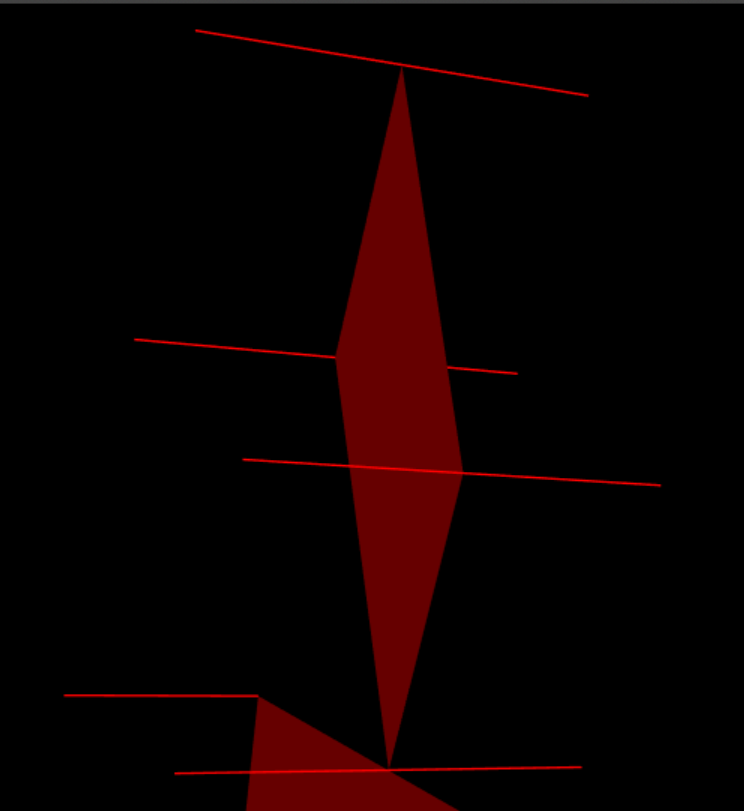

## Aula 3 <p> Iluminação e Materiais

Esta aula tem como objetivo fazer os alunos aprender a manipular iluminação e materiais.  

### Criação de um *slider* no **GUI**:
Inicialmente, pede para criarmos uma barra para controlar a luz ambiente.  
Para isso, é necessário criar uma varíavel  como fazíamos anteriormente em **MyScene**, em **initBuffers**
```javascript
this.globalLight = 0.3;
```
Agora, antes do **PrimitiveDraw**:
```javascript
this.setGlobalAmbientLight(this.globalLight, this.globalLight,this.globalLight, 1.0);
```
**MyInterface**
```javascript
this.gui.add(this.scene, 'globalLight', 0.01, 1.0).name('Global Ambient Light');
```
### Adição de um objeto a uma caixa de seleção no **GUI**:

Inicialmente, é necessário criar o objeto tal como se fazia nos capitulos anteriores.  
Porém, em vez de dar display, basta adicionar o objeto á lista **this.objects[]** e ao vetor **this.objectIDs**:
```javascript
  this.objects = [this.plane, this.pyramid, this.cone, this.tangram, this.cube];
  this.objectIDs = { 'Plane': 0 , 'Pyramid': 1, 'Cone': 2, 'Tangram': 3, 'Cube':4 };
```
(No caso anterior adicionamos um *Tangram* e um *Cubo* aos objetos).  

### Declaração de normais em objetos:

Para criar normais, é necessário adicionar uma lista de normais na classe de cada objeto, no *initBuffers*  
Exemplo(MyParallelogram):
```javascript
this.normals = []
    for (var i = 0; i <= 3; i++) {
        this.normals.push(0, 0, 1);
    }
    for (var i = 0; i <= 3; i++) {
        this.normals.push(0, 0, -1);
    }
```
Nesta situação, são percorridos os vértices e, conforme a ordem especificada na lista **this.vertices**, é desenhado um vetor no respetivo vértice.  
Caso seja necessário desenhar mais do que um vetor no mesmo vértice, é necessário declarar novamente os mesmos vértices para que se mantenha a ordem.
```javascript
this.vertices = [
  0, 0, 0,
  2, 0, 0,
  1, 1, 0,
  3, 1, 0,

  0, 0, 0,
  2, 0, 0,
  1, 1, 0,
  3, 1, 0,
];
```
Como se pode ver, **os vértices são repetidos** para que o segundo for volte a percorrer os vértices e desenhe um vetor com o sentido oposto no eixo Oz.  
O resultado final é este:


### Criação de Materiais para colorir o *Tangram*
Neste passo, é necessário criar um novo material na função **initMaterials** do *Tangram* e aplicá-lo antes do display de cada figura no override da função display().  

Criação de um Material:
```javascript
  this.purple = new CGFappearance(this.scene);
  this.purple.setAmbient(...this.scene.hexToRgbA('#9900ff'));
  this.purple.setDiffuse(...this.scene.hexToRgbA('#9900ff'));
  this.purple.setSpecular(...this.scene.hexToRgbA('#ffffff'));
  this.purple.setShininess(10.0);
```
Método **apply()** antes do display:
```javascript
  this.scene.pushMatrix();
  this.scene.translate(0, Math.sqrt(2), 0);
  this.scene.rotate(3*Math.PI/4, 0, 0, 1);
  this.purple.apply();
  this.triangleSmall.display();
  this.scene.popMatrix();
```
A função **hexToRgbA** é utilizada para facilitar a aplicação de uma cor, porém, podem apenas ser utilizados os valores rgb das cores na gama [0-255].  
(É possível verificar a cor de uma foto em diferentes sites, como por exemplo : [Image Color Picker](https://imagecolorpicker.com/))
