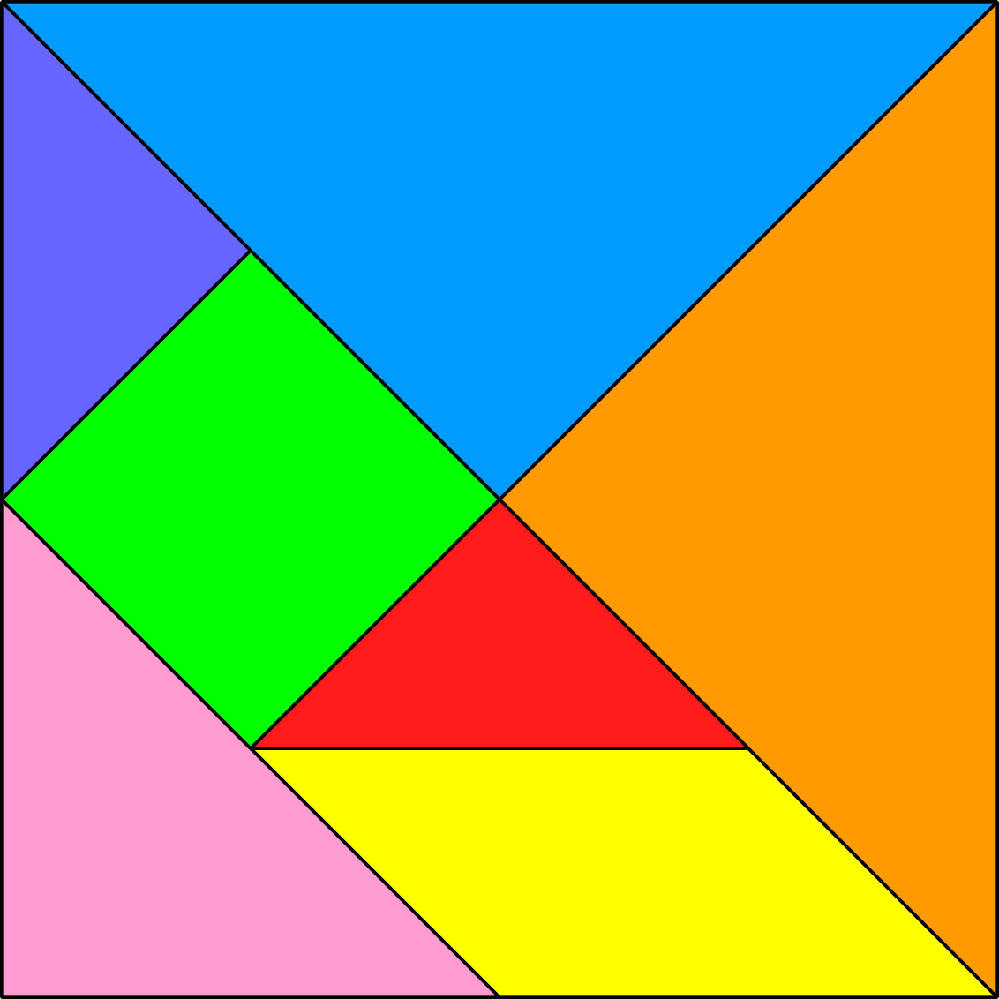

## Aula4 <p> Aplicação de Texturas

### Aplicação de uma textura a um material:

É necessário adicionar 2 linhas no final da criação de um material.
```javascript
this.material = new CGFappearance(this.scene);
this.material.setAmbient(0.1, 0.1, 0.1, 1);
this.material.setDiffuse(0.9, 0.9, 0.9, 1);
this.material.setSpecular(0.1, 0.1, 0.1, 1);
this.material.setShininess(10.0);
//Funções que aplicam uma textura a um material
this.material.loadTexture('images/tangram.png');
this.material.setTextureWrap('REPEAT', 'REPEAT');
```
Neste caso, adicionamos uma textura baseada na imagem **(tangram.png)**.  
Esta textura está no modo **Repeat**  

### Definição de coordenadas de textura:

É necessário criar um array na função initBuffers da Classe, deste modo:
```javascript
this.texCoords = [
  0.25, 0.25,
  0, 0.5,
  0.5, 0.5,
  0.25, 0.75
];
```
Os valores terão que ser entre 0 e 1, e correspondem ás coordendas de textura em cada vértice declarado em **this.vertices**.  
A seguinte imagem de um Tangram será usada como textura.

Para obter as coordenadas dos dois objetos **MyTriangleBig**, e necessário estas 2 listas de coordenadas de textura:
```javascript
// MyTriangleBig laranja
this.texCoords = [
    0.5, 0.5,
    1, 1,
    1, 0
  ];
  // MyTriangleBig Azul
this.textCoords = [
    0, 0,
    0.5, 0.5,
    1, 0
  ];
```
Nesta situação, como é necessário utilizar múltiplas coordenadas de textura, é necessário fazer uma chamada á função **updateTexCoords()** e alterar as coordenadasde textura, quando necessário, pelo que o código na Classe MyTriangleBig será deste género:
```javascript
initBuffers(){
  /* //Definiçao dos vertices, indices e textCoords
  this.vertices = [.....];
  this.indices = [....];
  this.texCoords = [....];
  */
  this.primitiveType = this.scene.gl.TRIANGLES;
  this.initGLBuffers();
  this.updateTexCoordsGLBuffers();
}

updateTexCoords(coords) {
this.texCoords = [...coords];
this.updateTexCoordsGLBuffers();
}
```
Para alterar as coordenadas de textura, é necessário invocar a função udpateTextCoords(coords) antes do display (neste caso, no display() do Tangram)
```javascript
this.scene.pushMatrix();
this.scene.translate(0, Math.sqrt(2)/2 + 3 * Math.sqrt(2), 0);
this.scene.rotate(3*Math.PI/4, 0, 0, 1);
this.triangleBig.updateTexCoords([1, 0,
                                 0.5, 0.5,
                                 1, 1]);
this.triangleBig.display();
this.scene.popMatrix();
```
### Criação de uma textura <p> Uso de Múltiplas Texturas

Para usar múltiplas texturas, é necessário que estejam definidas no construtor **(Criação das texturas)**:
```javascript
this.top = new CGFtexture(this.scene,'images/mineTop.png');
this.bottom = new CGFtexture(this.scene,'images/mineBottom.png');
this.side = new CGFtexture(this.scene,'images/mineSide.png');
```
Quando for necessário utilizar a textura pretendida, terá que se chamar a função **setTexture(CGFtexture)**.  
Função **display()** de MyUnitCubeQuad:
```javascript
// Side
this.minecraftTexture.setTexture(this.side);
this.minecraftTexture.apply();
this.scene.gl.texParameteri(this.scene.gl.TEXTURE_2D, this.scene.gl.TEXTURE_MAG_FILTER, this.scene.gl.NEAREST);
//Side 1
this.scene.pushMatrix();
this.scene.rotate(-Math.PI/2, 0,1,0);
this.scene.translate(0,0,0.5);
this.quad.display();
this.scene.popMatrix();
//...Remaining Sides
```
Inicialmente, define-se a textura a aplicar (com a função setTexture). Em seguida, aplica-se a textura e, por fim, fazem-se as alterações nas matrizes de transformação.  

A função:
```javascript
this.scene.gl.texParameteri(this.scene.gl.TEXTURE_2D, this.scene.gl.TEXTURE_MAG_FILTER, this.scene.gl.NEAREST);

```
está presente para alterar  o tipo de filtragem usado no display, para obter o efeito pretendido no enunciado.  
Se este efeito não for utilizado, será feita uma interpolação linear das cores na passagem das texturas, que não será ideal, dado que as imagens iniciais são de pouca resolução, 16*16 bits.
