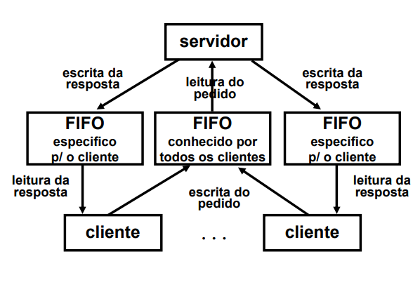

# 1
- DMA : Permite acesso direto á memória, possibilitando o uso do CPU para outros processos, enquanto se executam instruções I/O, aumentando o grau de multiprogramação.
- Test & Set : Permite a execução de um conjunto de instruções atomicamente, ou seja permite a execução de uma seção crítica ininterruptamente.
- bit de página válida/inválida : Permite verificar se uma página em memória lógica está também em memória (RAM).

# 2

## a)
```c
//semaphore initialization (in the main function with global range)
init(A,0);
init(B,0);
init(C,0);
```

```c
// P1
signal(A);
signal(A);
wait(B);
wait(C);
```

```c
// P2
signal(B);
signal(B);
wait(A);
wait(C);
```

```c
// P3
signal(C);
signal(C);
wait(A);
wait(B);
```

## b)
Existem 4 condições que constituem  as condições necessárias e suficientes para a ocorrência de deadlock, que são:
1. Exclusão Mútua;  
2. Retém e espera;
3. Não preempção dos recursos:
4. Espera circular;
Deste modo, podemos concluir que é possível prevenir o deadlock assegurando que pelo menos 1 das 4 condições necessárias não se verificam.

É possível demonstrar que a condição Não preempção dos recursos não se verifica, dado que quando um processo retém um recurso, existem outros processos que o podem libertar.

Ex:
P1 retém o recurso B wait(B) e o programa P2 liberta este recurso signal(B).

Deste modo, podemos concluir que não ocorrer deadlock.

# 3

O escalonamento com preempção corresponde á possibilidade de um processo ser interrompido, sendo forçado a ceder o CPU.

Um processo CPU BOUND corresponde a um Processo que necessita de um modo intenso o uso do CPU, ou seja, passa a maior parte do tempo a usar o CPU, pelo que pode ter CPU-BURST mais longos.

A afirmação dada depende em grande parte do algoritmo de escalonamento utilizado. Por exemplo, o uso do algoritmo preemptivo de Round Robin , favorece os processos CPU-BOUND. Por outro lado, o uso do algoritmo FCFS(First Come First Served) é não preemptivo e favorece os processos CPU-BOUND.

# 4
## a)
Endereços -> 16 bits -> 2^16
Páginas -> 512 bits -> 2^9
Endereço Lógico -> 0000010001111101

2^16 / 2^9 = 2^7

-> Nos 16 bits, os primeiros 9 são para as páginas e os restantes 7 são para o offset
-> Página -> 000001000
-> Offset -> 1111101

### Segunda parte da pergunta
Página -> 1000 = 8

## b)
### Deteção do Thrashing

O thrashing pode ser detetado quando ocorre:
1. elevada atividade de transferência de páginas
2. Baixa utilização do processador
3. Baixa utilização de outros dispositivos

### Parar o Thrashing

O thrashing pode ser parado de várias maneiras, nomeadamente:
1. Fazer o swap out de um ou mais processos
2. Retomar a sua execução quando houver mais memória livre
3. Por vezes, impõe-se limites mínimos ao tempo que um processo tem de estar em memória ou em disco

### Evitar o Thrahsing
Para evitar o Thrashing, pode-se usar um dos seguintes algoritmos:
1. Estratégia do conjunto de trabalho
2. Estratégia da frequência da falta de página

Logo, basta mostrar um dos métodos, para demonstrar como evitar thrashing:
- Estratégia da frequência da falta de página:
1. Monitorizar a frequência de falta de páginas de um processo;
2. Estabelecer um gama de frequências aceitáveis
3. Acima de uma certa frequência, atribuir mais uma frame ao processo; Se não houver frames disponíveis, suspender o processo;
4. Abaixo de uma certa frequência, retirar um frame ao processo

# 5
## a)
Deve ser aberto em modo O_APPEND em vez de em modo O_WRONLY, pois a abertura no primeiro modo inicializa a abertura do ficheiro com o cursos a apontar para o fim. Deste modo, é possível que os ficheiros independentes acrescentem informação (append) ao ficheiro, ao invés de substituir a informação que existiria no início (O_WRONLY).

## b)
Caso o modo de apensamento não estivesse disponível, seria necessário utilizar a função `lseek()`, colocando a flag SEEK_END no parâmetro whence.

# 6
## a)
```c
int numbits = atoi(argv[1]);

execl("/home/sope/gen_bit","gen_bit",NULL);

Após a linha *13*, acrescentar a instrução:
printf("%s",&bits[i]);
```

## b)
Dado que os PID's são consecutivos, vão estar a alterar entre par e ímpar, consecutivamente, pelo que os bits gerados serão sempre 0 e 1 alternados (A começar a 0 caso o primeiro seja par e a começar a 1 caso seja ímpar)

## c)
Para acrescentar aleatoriedade seria possível acrescentar, depois da linha 12, as seguintes linha de código:
```c
ret += rand() % 2;
```
Ou seja, seria utilizada a função `rand()` para gerar um número pseudoaleatório, de modo a erar alguma aleatoriedade.

Porém, como `rand()` gera números pseudoaleatórios, estes não são verdadeiramente aleatórios, pelo que o resultado continuaria a ser, de certo modo, previsível, ou seja, a aleatoriedade continuaria ser limitada.

## d)

```c
// A adicionar antes da main
int global = 0;
action_handler(int signo){
    if(signo == SIGUSR1){
        global = 0;
    }
    else if(signo == SIGUSR2){
        global = 1;
    }
}
// A adicionar antes do for
struct sigaction action1, action2;

action1.sa_handler = action_handler;
sigemptyset(&action1.sa_mask);
action1.sa_flags = 0;

action2.sa_handler = action_handler;
sigemptyset(&action2.sa_mask);
action2.sa_flags = 0;

sigaction(SIGUSR1,action1,NULL);
sigaction(SIGUSR2,action2,NULL);

// a substituir pelas linhas 11,12 e 13
wait(NULL);
strcat(bits, global == 0 ? "0" : "1");

```

# 7

## a)

Recomendaria o uso de FIFO, pois apenas estes podem ser utilizados na comunicação entre processos não tenham um antecessor e comum, como é o caso (porque os threads estão ligados a processos distintos).

Para além disso, como a comunicação é bidirecional, teriam de ser utilizado 1 FIFOS para cada thread criada, para além de um Fifo conhecido pormtodos os clientes.



## b)
```c
void *thread1(void* nothing){
    int fd_public,fd_private;
    int buffer[256];

    if(fd_public = open("public",O_WRONLY))
        exit 1;

    sprintf(buffer,"private_%s",getpid());

    if(makefifo("buffer",0660)){
        close(fd_public);
        exit 2;
    }

    if(fd_private = open("buffer",O_RDONLY)){
        close(fd_public);
        exit 3;
    }
    // Agora teria de interagir com os ficheiros...

    return NULL;
}
```

## c)

```c
// Assumindo que o fifo_public ainda está aberto
char buf[256];
int len;

if(sprintf(buf,"pid = %d, tid = %d",getpid(),pthread_self()) < 0 ){
    close(fd_public);
    close(fd_private);
    unlink(fd_private);
    exit 2;
}

len = strlen(message) + 1;

if(write(fd_public,len,buf) < 0){
    close(fd_public);
    close(fd_private);
    ulink(fd_private);
    exit 3;
}

// Rest of the code...

```

## d)

Seria possível mandar um sinal para a thread, usando um pthread_kill(tid,signo), sendo tid o thread id da thread com a qual querermos comunicar.

Outra maneira seria o envio de uma mensagem para o fifo publico, indicando esta terminação, através de um valor de uma struct, por exemplo.

## e)

```c
// Seria necessário fechar todos os ficheiros que fossem abertos, e dar unlink ao fifo privado criado

if(close(fd_public) == -1){
    exit 4;
}
if(close(fd_private) == -1){
    exit 5;
}
if(unlink(fd_private) == -1){
    exit 6;
}
return 0;

```

# 8

## a)

```c
int main(void){

    pthread_t tid[11];
    int tharg[10];
    for(t = 0; t < 10;t++){
        tharg[t] = t;
        pthread_create(&tid[t],NULL,insert_thread_name_here,&tharg[t]);
    }
    pthread_create(&tid[10],insert_thread_name_here,NULL);

}
```
