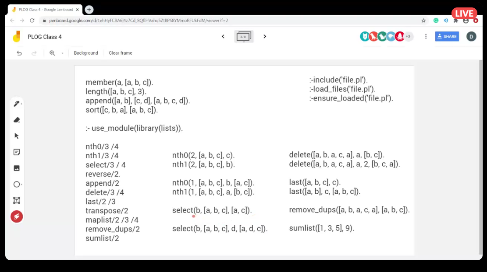

# Aula 4 

### Inclusão de ficheiros

- :-include('file.pl').
- :-load_files('file.pl').
- :-ensure_oaded('file.pl).

### Métodos de listas:

#### Métodos built-in de listas

- member
- length
- append
- sort

#### Biblioteca de listas
- :-use_module(library(lists)). -> Usar para incluir a biblioteca de listas

Esta biblioteca contém as seguintes funções sobre listas
 

### Exercícios propostos para a aula

- [ ] 1.a
- [ ] 1.b
- [ ] 6

##### 1.a)

Escreva um programa em Prolog que determine um caminho entre dois nós de um Grafo: 
Utilizando pesquisa em profundidade (evitando ciclos);

